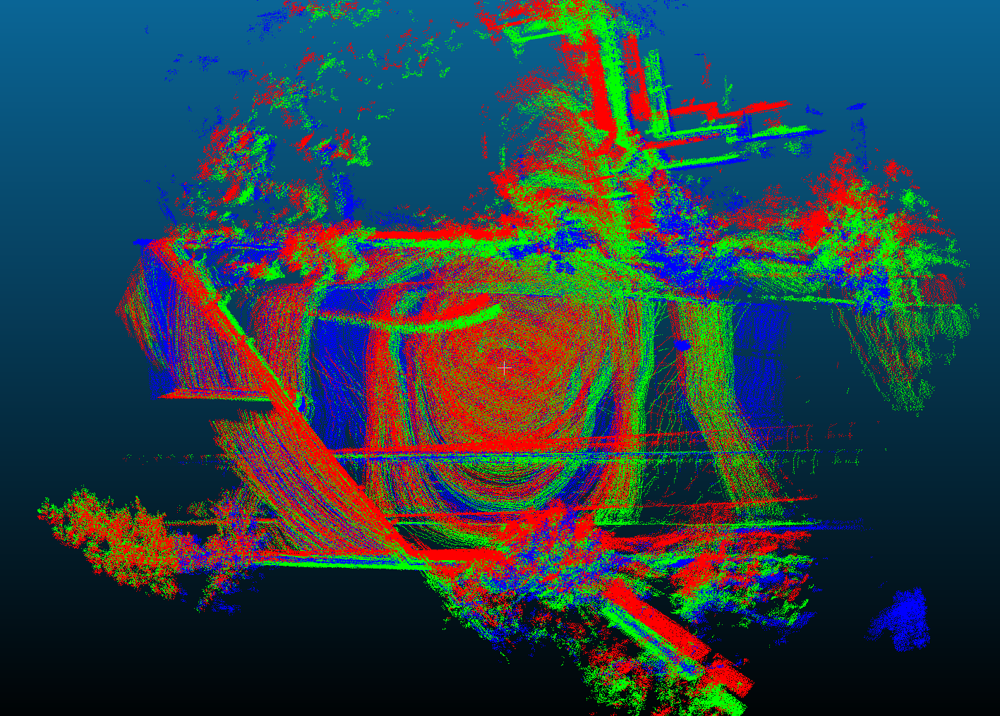

# lidar_trajectory_validation

**tl;dr**: Check the quality of a lidar trajectory from SLAM using loop closure distances given known loop closure timestamps




The above shows an example output with one loop closure. The scans show the aggregated scans before and after alignment. Blue: reference scan (first loop closure location), Red: target scan (second loop closure location) transformed into estimated reference scan frame, Green: target scan transformed into reference scan frame after alignment.

## Goal

The goal of this tool is to automatically validate the quality of a SLAM trajectory of a Lidar frame by running loop closures on known loop closure locations. The user inputs a list of timestamps pairs for when they know that the device re-visited a location. This program will then aggregate a dense scan around both locations, run filters to clean up the aggregate scans, then run alignment to estimate the error of the target pose relative to the reference pose. 

Alignment and filters are completely configurable. We also always output very detailed visuals to validate the alignment, filters, etc.

## Dependencies

This repo only depends on our internal [libbeam](https://github.com/BEAMRobotics/libbeam) library. 

Libbeam depends on the following:

* [ROS](https://www.ros.org/)
* [Catch2](https://github.com/catchorg/Catch2)
* [Eigen3](https://gitlab.com/libeigen/eigen/)
* [PCL 1.11.1 or greater](https://github.com/PointCloudLibrary/pcl)
* [gflags](https://github.com/gflags/gflags)
* [nlohmann json](https://github.com/nlohmann/json)

For more information on libbeam and it's dependencies, see the [docs](https://github.com/BEAMRobotics/libbeam). 

## Install

First, install the libbeam dependencies. We have a [script](https://github.com/BEAMRobotics/libbeam/blob/master/scripts/install.bash) to help make this easier which you can run, or just copy commands from.

We recommend using catkin to build this tool and libbeam.

```
mkdir -p ~/catkin_ws/src
cd ~/catkin_ws
catkin build -j2
```

Clone libbeam and this repo:

```
cd ~/catkin_ws/src
git clone --depth 1 https://github.com/BEAMRobotics/libbeam.git
git clone --depth 1 https://github.com/nickcharron/lidar_trajectory_validation.git
```

Build:

```
cd ~/catkin_ws/
catkin build -j2
```

## Running the tool

For information on required inputs to the binary and their formats, run the binary with -help flag:

```
cd ~/catkin_ws/
./build/lidar_trajectory_validation/lidar_trajectory_validation_main -help
```

For file formats, see example folder. We also have example configs for matchers (icp, gicp, ndt) and for the trajectory validation binary (config.json)